# Insertion Sort
Insertion sort is a simple sorting algorithm that works similar to the way you sort playing cards in your hands. The array is virtually split into a sorted and an unsorted part. Values from the unsorted part are picked and placed at the correct position in the sorted part.

## Pseudocode
```pseudocode

InsertionSort(int[] input)
  LET sorted = New Empty Array
  sorted[0] = input[0]
  FOR i from 1 up to input.length
    Insert(int[] sorted, input[i])
  initialize i to 0
  WHILE value > sorted[i]
    set i to i + 1
  WHILE i < sorted.length
    set temp to sorted[i]
    set sorted[i] to value
    set value to temp
    set i to i + 1
  append value to sorted
  return sorted
  ```

## python Code
```python
def InsertionSort(input):
    sorted = []
    sorted.append(input[0])
    
    for i in range(1, len(input)):
        value = input[i]
        j = 0
        while value > sorted[j]:
            j = j + 1
        sorted.insert(j, value)
    
    return sorted
```
## Trace

simple array: [8,4,23,42,16,15]

pass 1: [4,8,23,42,16,15]

- In the first pass, we start with the second element in the array, and compare it to the first element. If the second element is smaller, we swap the two elements. In this case, 4 is smaller than 8, so we swap them.

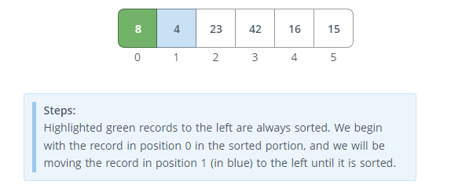
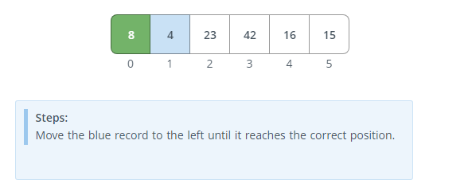

pass 2: [4,8,23,42,16,15]


- In the second pass, we start with the third element in the array, and compare it to the second element. If the third element is smaller, we swap the two elements. In this case, 23 is larger than 8, so we do not swap them.

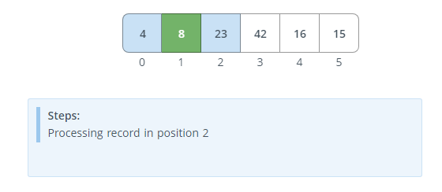
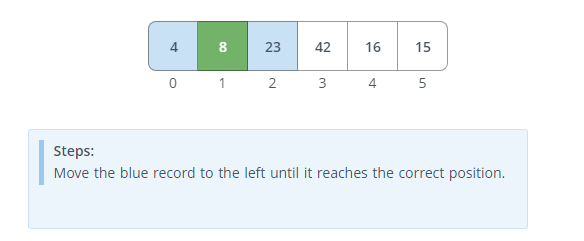


pass 3: [4,8,23,42,16,15]

- In the third pass, we start with the fourth element in the array, and compare it to the third element. If the fourth element is smaller, we swap the two elements. In this case, 42 is larger than 23, so we do not swap them.

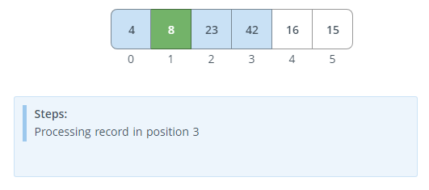
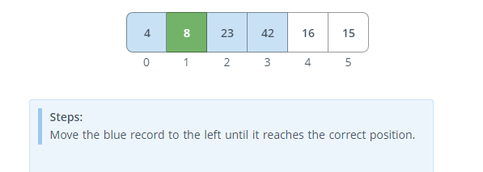

pass 4: [4,8,16,23,42,15]

- In the fourth pass, we start with the fifth element in the array, and compare it to the fourth element. If the fifth element is smaller, we swap the two elements. In this case, 16 is smaller than 42, so we swap them.

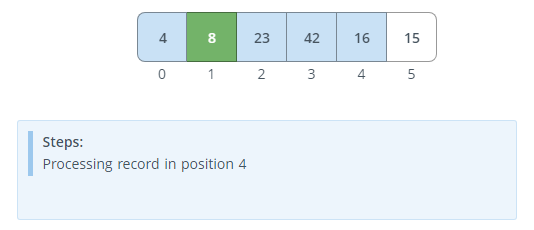
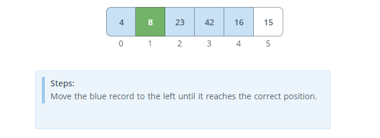

pass 5: [4,8,15,16,23,42]

- In the fifth pass, we start with the sixth element in the array, and compare it to the fifth element. If the sixth element is smaller, we swap the two elements. In this case, 15 is smaller than 42, so we swap them.

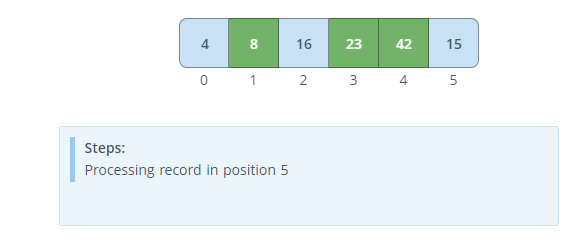
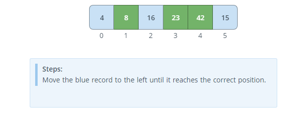


pass 6: [4,8,15,16,23,42]

- In the sixth pass, we start with the seventh element in the array, and compare it to the sixth element. If the seventh element is smaller, we swap the two elements. In this case, there is no seventh element, so we do not swap them.

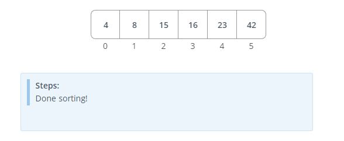

## Efficiency

Time: O(n^2)

Space: O(1)


