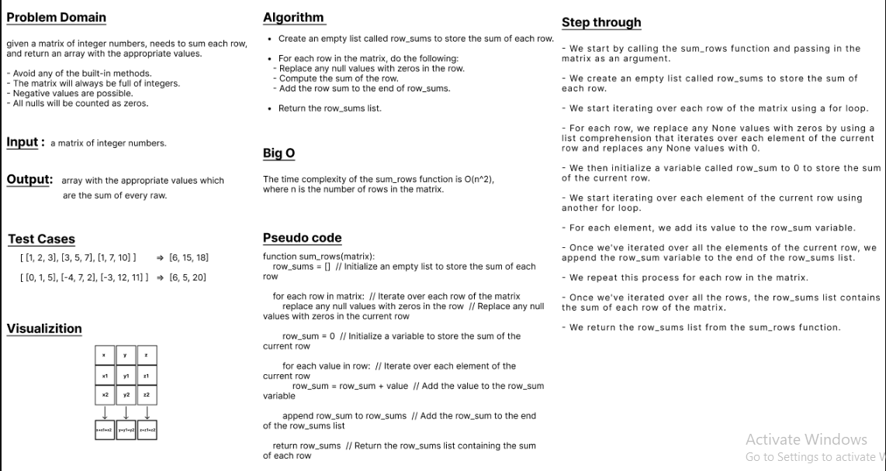

# data-structures-and-algorithms

# Challenge Title
write a python function to add up the sum of each row in a matrix of arbitrary size, and return an array with the appropriate values.
- Avoid utilizing any of the built-in methods available to your language.
- The matrix will always be full of integers.
- Negative values are possible.
- All nulls will be counted as zeros.

## Whiteboard Process


## Approach & Efficiency
The sum_rows function takes a matrix and returns a list of the sum of each row in the matrix. It has a time complexity of O(n*m), where n is the number of rows and m is the number of columns, and a space complexity of O(n). A slightly more efficient version of the function could use the built-in sum function to sum up the row instead of a for loop.

## Solution

```python
def sum_rows(matrix):
    """
    Sums up the values in each row of a given matrix and returns an array
    with the results.
    Args:
        matrix (list[list[int]]): The matrix to sum up.
    Returns:
        list[int]: An array with the sum of each row in the matrix.
    """
    row_sums = [0] * len(matrix)
    for i, row in enumerate(matrix):
        # Replace nulls with zeros
        row = [0 if x is None else x for x in row]
        # Sum up the row
        row_sum = 0
        for value in row:
            row_sum += value
        row_sums[i] = row_sum
    return row_sums


ex1 = [[1, 2, 3], [3, 5, 7], [1, 7, 10]]
ex2 = [[0, 1, 5], [-4, 7, 2], [-3, 12, 11]]

print(sum_rows(ex1))
print(sum_rows(ex2))
```

### Saif Obeidat