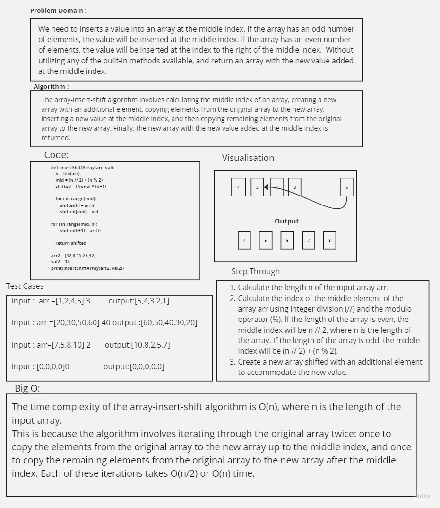

# data-structures-and-algorithms


# Challenge Title
Write a function called insertShiftArray which takes in an array and a value to be added. Without utilizing any of the built-in methods available to your language, return an array with the new value added at the middle index.

## Whiteboard Process


## Approach & Efficiency
The array-insert-shift algorithm involves calculating the middle index of an array, creating a new array with an additional element, copying elements from the original array to the new array, inserting a new value at the middle index, and then copying remaining elements from the original array to the new array. Finally, the new array with the new value added at the middle index is returned.

## Solution

``` python
def insertShiftArray(arr, val):
    n = len(arr)
    mid = (n // 2) + (n % 2)   
    shifted = [None] * (n+1)   

    
    for i in range(mid):
        shifted[i] = arr[i]


    shifted[mid] = val

    
    for i in range(mid, n):
        shifted[i+1] = arr[i]

    return shifted

arr2 = [42,8,15,23,42]
val2 = 16
print(insertShiftArray(arr2, val2))


```

### Saif Obeidat