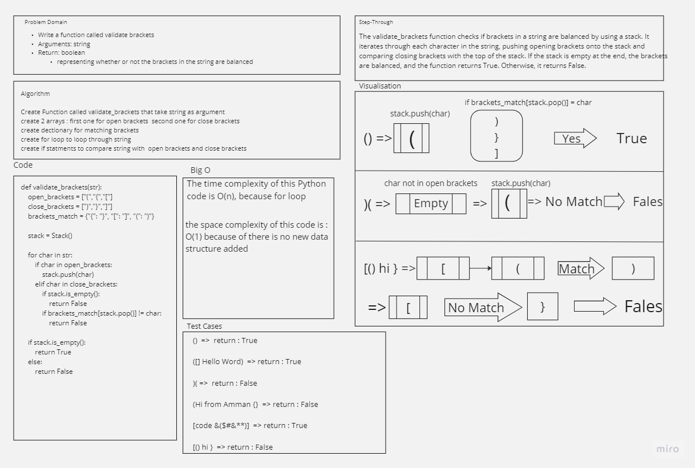

# Challenge Title 
## stack-and-queue-brackets

## Whiteboard Process


## Approach & Efficiency
Create a function called validate brackets which takes a string as its only argument, and returns a boolean representing whether or not the brackets in the string are balanced. There are 3 types of brackets:

Round Brackets : ()
Square Brackets : []
Curly Brackets : {}

## Solution
``` python
def validate_brackets(string):
    """
    A function that takes a string as its only argument, and returns a boolean representing whether or not the brackets in the string are balanced.
    """
    stack = []
    brackets = {
        '(': ')',
        '[': ']',
        '{': '}'
    }
    for char in string:
        if char in brackets:
            stack.append(char)
        elif char in brackets.values():
            if not stack:
                return False
            if brackets[stack.pop()] != char:
                return False
    return not stack
```