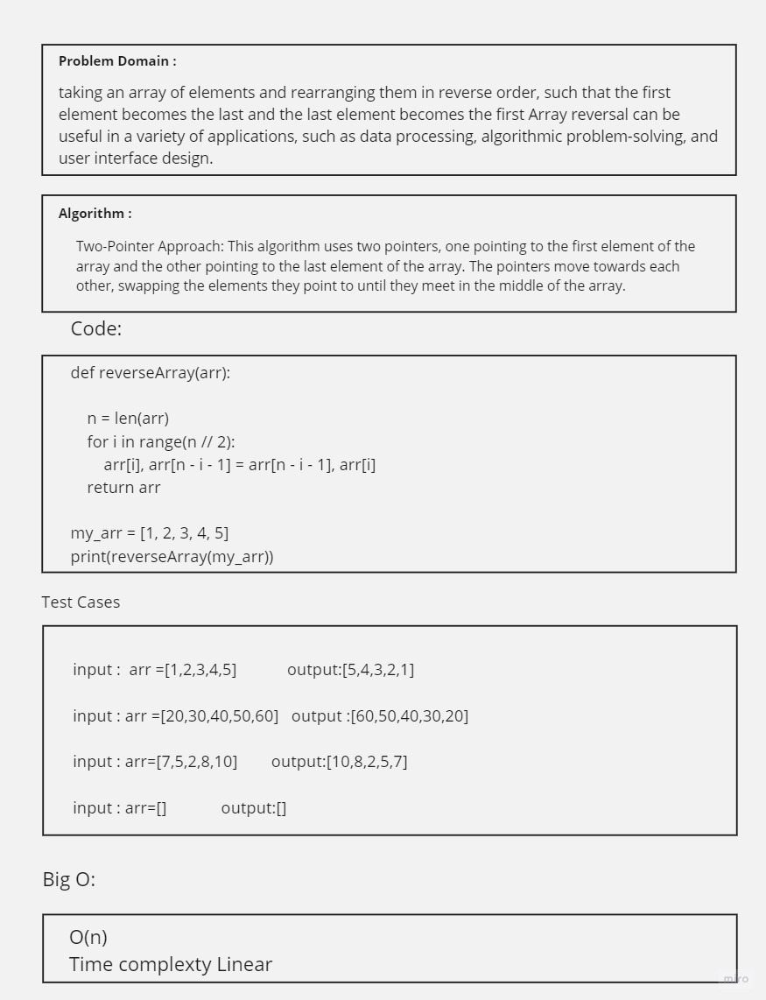

# data-structures-and-algorithms


# Challenge Title
Write a function called reverseArray which takes an array as an argument. Without utilizing any of the built-in methods available to your language, return an array with elements in reversed order.

## Whiteboard Process


## Approach & Efficiency
1- Calculate the length n of the input array arr.
2- Calculate the index of the middle element of the array arr using integer division (//) and the modulo operator (%). If the length of the array is even, the middle index will be n // 2, where n is the length of the array. If the length of the array is odd, the middle index will be (n // 2) + (n % 2).
3-Create a new array shifted with an additional element to accommodate the new value.

## Solution

``` python
def reverseArray(arr):
    
    n = len(arr)
    for i in range(n // 2):
        arr[i], arr[n - i - 1] = arr[n - i - 1], arr[i]
    return arr


my_arr = [1, 2, 3, 4, 5]
print(reverseArray(my_arr))
```

