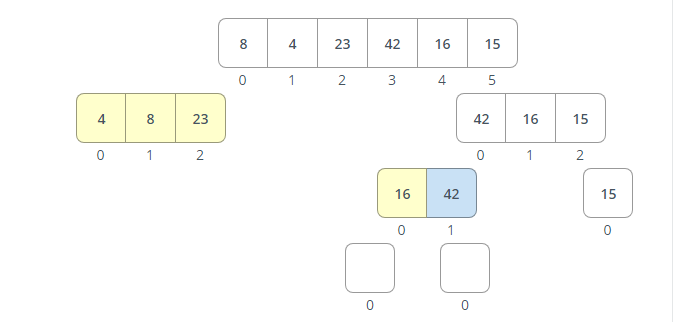

# Marge Sort
margin sort is a divide and conquer algorithm that divides a list into equal halves until it has two single elements and then merges the sub-lists until the entire list has been reassembled in order.

## Pseudocode
```pseudocode
ALGORITHM Mergesort(arr)
    DECLARE n <-- arr.length

    if n > 1
      DECLARE mid <-- n/2
      DECLARE left <-- arr[0...mid]
      DECLARE right <-- arr[mid...n]
      // sort the left side
      Mergesort(left)
      // sort the right side
      Mergesort(right)
      // merge the sorted left and right sides together
      Merge(left, right, arr)

ALGORITHM Merge(left, right, arr)
    DECLARE i <-- 0
    DECLARE j <-- 0
    DECLARE k <-- 0

    while i < left.length && j < right.length
        if left[i] <= right[j]
            arr[k] <-- left[i]
            i <-- i + 1
        else
            arr[k] <-- right[j]
            j <-- j + 1

        k <-- k + 1

    if i = left.length
       set remaining entries in arr to remaining values in right
    else
       set remaining entries in arr to remaining values in left
```

## python Code
```python
def Mergesort(arr):
    if len(arr) > 1:
        mid = len(arr) // 2
        left = arr[:mid]
        right = arr[mid:]
        
        Mergesort(left)
        Mergesort(right)
        
        marge(left, right, arr)

def marge(left, right, arr):
    i = 0
    j = 0
    k = 0
    
    while i < len(left) and j < len(right):
        if left[i] <= right[j]:
            arr[k] = left[i] 
            i += 1
        else:
            arr[k] = right[j]
            j += 1
            
        k += 1
        
    if i == len(left):
        arr[k:] = right[j:]
    else:
        arr[k:] = left[i:]
        
    return arr
```

## Trace

simple array: [8,4,23,42,16,15]

pass 1: [4,8,23,42,16,15]

- In the first pass, we divide the array in half, and then divide each half in half, until we have single element arrays. Then we merge the arrays back together, sorting as we go. In this case, 4 is smaller than 8, so we swap them.


pass 2: [4,8,23,42,16,15]

- In the second pass, we compare the first element in the left array to the first element in the right array. In this case, 4 is smaller than 23, so we swap them.


pass 3: [4,8,23,42,16,15]

- In the third pass, we compare the right array’s 16 to the left array’s 42. 16 is smaller, so we swap them.




pass 4: [4,8,15,16,23,42]

- In the fourth pass, we compare the right array’s 16 to the left array’s 15. 15 is smaller, so we put 15 in the array first and then 16 and then 42.


pass 5: [4,8,15,16,23,42]

- In the fifth pass, we compare the left array's first element to the right array's first element. 4 is smaller, so we put 4 in the array first and then 8 and then 15 and then 16 and then 23 and then 42.


## Efficency
- Time: O(nlogn)
- Space: O(n)


