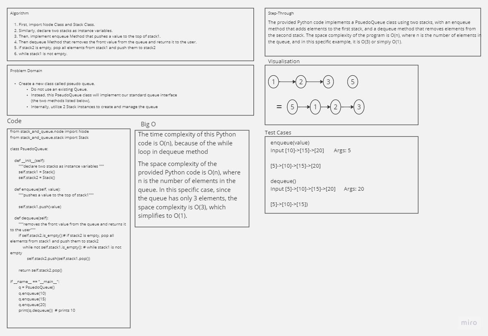

# Challenge Title
Stacks and Queues

## Whiteboard Process
### psuedoQueue


### Anime Shelter


## Approach & Efficiency
Create a Stack class that includes
- A method called push which takes any value as an argument and adds a new node with that value to the top of the stack with an O(1) Time performance.
- A method called pop that does not take any argument, removes the node from the top of the stack, and returns the node’s value.
- A method called peek that does not take an argument and returns the value of the node located on top of the stack, without removing it from the stack.
- A method called isEmpty that takes no argument, and returns a boolean indicating whether or not the stack is empty.

Create a Queue class that includes
- A method called enqueue which takes any value as an argument and adds a new node with that value to the back of the queue with an O(1) Time performance.

- A method called dequeue that does not take any argument, removes the node from the front of the queue, and returns the node’s value.

- A method called peek that does not take an argument and returns the value of the node located in the front of the queue, without removing it from the queue.

- A method called isEmpty that takes no argument, and returns a boolean indicating whether or not the queue is empty.

## Solution
    
    ``` python

    class Node:
        """
        A class representing a node in a linked list.

        Attributes:

        ----------
        value : any
            The value to be stored in the new node.
        next : Node or None
            A reference to the next node in the linked list, or None if this is the last node.
        """
        def __init__(self, value):
            self.value = value
            self.next = None

            from stack_and_queue.node import Node

class Stack:

    def __init__(self):
        self.top = None

    def push(self, value):

        node = Node(value)

        if self.top == None:
            self.top = node

        else:
            node.next = self.top
            self.top = node

    def pop(self):

        if self.top == None:
            raise IndexError("This Stack is Empty!!!")
        
        else:
            temp = self.top
            self.top = self.top.next
            return temp.value
        
    def peek(self):

        if self.top == None:
            raise IndexError("This Stack is Empty!!!")
        
        else:
            return self.top.value
        
   
    
    def is_empty(self):
        return not bool(self.top)

class Queue:

    def __init__(self):
        self.front = None
        self.rear = None

    def enqueue(self, value):

        node = Node(value)

        if self.front == None:
            self.front = node
            self.rear = node

        else:
            self.rear.next = node
            self.rear = node

    def dequeue(self):

        if self.front == None:
            raise IndexError("This Queue is Empty!!!")
        
        else:
            temp = self.front
            self.front = self.front.next
            return temp.value

    def peek(self):

        if self.front == None:
            raise IndexError("This Queue is Empty!!!")
        
        else:
            return self.front.value

    def is_empty(self):
        return not bool(self.front)

        


    


        ```

    
